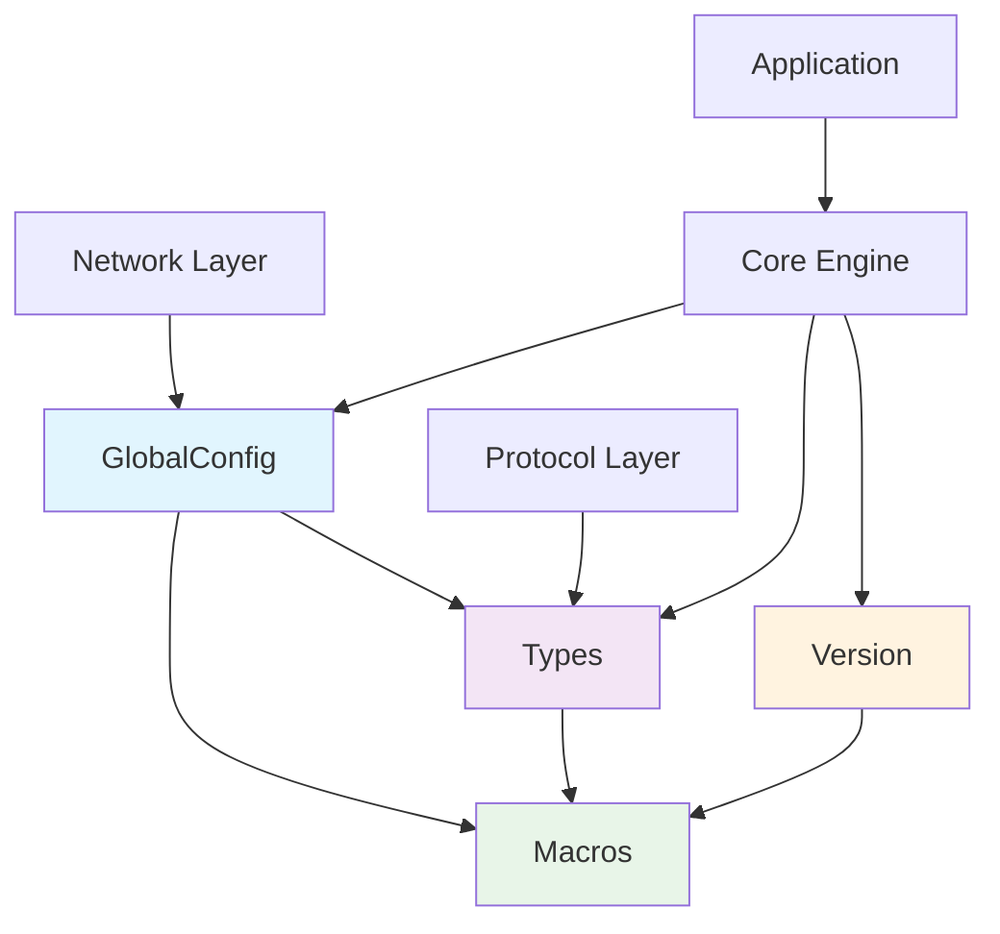

# Common Utilities Library

## 📋 Overview

The `common/` directory contains the foundational utilities and type definitions used throughout the CppWebSocket-Server project. These headers provide consistent type aliases, configuration management, version information, and compiler macros that ensure code consistency and maintainability across the entire codebase.

## 🎯 Main Purpose

The common library serves as the **foundational layer** that provides:

- **Type Safety**: Consistent type definitions across the project
- **Configuration Management**: Global configuration access with hot-reload
- **Compiler Abstraction**: Platform and compiler-specific macros
- **Version Management**: Semantic versioning and feature detection
- **Error Handling**: Standardized result and error types

## 🏗️ Architecture

```
common/
├── GlobalConfig.hpp  ───┐
├── Macros.hpp        ──┤→ Foundation Layer
├── Types.hpp         ──┤
└── Version.hpp       ──┘
```

### **Dependency Flow**:
```
GlobalConfig → depends on → Macros & Types
     ↑
All other components → depend on → Common utilities
```

## 📁 Component Details

### **GlobalConfig.hpp**
**Singleton configuration manager with thread-safe operations**

**Key Responsibilities**:
- Centralized configuration access
- Thread-safe configuration operations
- Runtime configuration overrides
- Hot-reload capability
- Configuration validation

**Key Features**:
- ✅ **Meyer's Singleton** - Thread-safe initialization
- ✅ **Runtime Overrides** - CLI/config file precedence
- ✅ **Hot Reload** - Configuration updates without restart
- ✅ **Thread Safety** - Mutex-protected operations

**Usage**:
```cpp
auto& config = GlobalConfig::getInstance();
config.initialize("config/server.json");
config.setRuntimeOverride("server.port", "8080");
auto cfgManager = config.getConfigManager();
```

### **Macros.hpp**
**Cross-platform compiler macros and utilities**

**Key Responsibilities**:
- Platform detection and abstraction
- Class behavior control (copy/move semantics)
- Compiler-specific optimizations
- Debug/Release mode support
- DLL export/import definitions

**Key Macros**:
- `WEBSOCKET_DISABLE_COPY` - Prevent object copying
- `WEBSOCKET_INTERFACE` - Define abstract base classes
- `WEBSOCKET_LIKELY/UNLIKELY` - Branch prediction hints
- `WEBSOCKET_ASSERT` - Debug assertions
- `WEBSOCKET_EXPORT` - DLL symbol visibility

**Usage**:
```cpp
class MyClass {
    WEBSOCKET_DISABLE_COPY(MyClass)
    WEBSOCKET_DEFAULT_MOVE(MyClass)
public:
    // class implementation...
};
```

### **Types.hpp**
**Project-wide type definitions and aliases**

**Key Responsibilities**:
- Fundamental type aliases (Buffer, String, etc.)
- Smart pointer aliases
- Functional types for callbacks
- WebSocket-specific types (Opcode, CloseCode)
- Result types with error handling

**Key Types**:
- `Buffer` - Binary data container
- `ClientID` - Unique client identifier
- `ResultValue<T>` - Monadic result type
- `Message` - WebSocket message structure
- `Error` - Extended error information

**Usage**:
```cpp
using namespace CppWebSocket;

Buffer data = {0x48, 0x65, 0x6c, 0x6c, 0x6f};  // "Hello"
Message msg(std::move(data), true);  // Text message
ResultValue<Message> result = processMessage(msg);

if (result.isSuccess()) {
    auto& value = result.value();
    // Process successful result
} else {
    auto& error = result.error();
    // Handle error
}
```

### **Version.hpp**
**Version information and feature detection**

**Key Responsibilities**:
- Semantic versioning compliance
- Feature detection at compile-time
- Build information reporting
- Version compatibility checking

**Key Features**:
- ✅ **Semantic Versioning** - MAJOR.MINOR.PATCH format
- ✅ **Feature Detection** - SSL, compression, metrics support
- ✅ **Build Information** - Timestamp, compiler, configuration
- ✅ **Compatibility Checking** - API version validation

**Usage**:
```cpp
std::cout << Version::getLibraryName() << std::endl;
// Output: "CppWebSocket-Server v1.0.0"

if (Version::hasSSLSupport()) {
    // Enable SSL features
}

if (Version::isCompatibleWith(1, 0)) {
    // Use version 1.0 compatible features
}
```

## 🔄 Class Relationships



## 🛠️ Key Changes and Improvements

### **1. Enhanced Type Safety**
**Before**:
```cpp
std::vector<uint8_t> buffer;
std::function<void(int, const std::string&)> callback;
```

**After**:
```cpp
Buffer buffer;
EventCallback<Message> callback;
```

### **2. Comprehensive Error Handling**
**Before**:
```cpp
bool sendMessage(const std::string& message);
```

**After**:
```cpp
ResultValue<Size> sendMessage(const Message& message);
```

### **3. Thread-Safe Configuration**
**Before**:
```cpp
static GlobalConfig* instance; // Manual singleton
```

**After**:
```cpp
static GlobalConfig& getInstance(); // Meyer's singleton
```

### **4. Cross-Platform Support**
**Before**:
```cpp
#ifdef _WIN32
    #define EXPORT __declspec(dllexport)
#else
    #define EXPORT
#endif
```

**After**:
```cpp
#define WEBSOCKET_EXPORT // Platform-abstracted
```

### **5. Modern C++ Features**
- **Move Semantics**: Default move operations where appropriate
- **Smart Pointers**: Consistent use of SharedPtr, UniquePtr
- **Type Aliases**: Semantic type names for better readability
- **constexpr**: Compile-time constants and functions

## 🚀 Usage Examples

### **Complete Server Setup**:
```cpp
#include "common/GlobalConfig.hpp"
#include "common/Types.hpp"
#include "common/Version.hpp"

using namespace CppWebSocket;

int main() {
    // Initialize configuration
    auto& config = GlobalConfig::getInstance();
    config.initialize("config/server.json");
    
    // Display version info
    std::cout << Version::getBuildInfo() << std::endl;
    
    // Use type-safe containers
    Buffer welcomeMsg = {'W', 'e', 'l', 'c', 'o', 'm', 'e'};
    Message message(std::move(welcomeMsg), true);
    
    return 0;
}
```

### **Error Handling Pattern**:
```cpp
ResultValue<Message> processWebSocketFrame(const Buffer& frameData) {
    try {
        WebSocketFrame frame = parseFrame(frameData);
        if (!frame.validate()) {
            return Error{1002, "Invalid frame structure"};
        }
        return Message{frame.getPayload(), frame.isText()};
    } catch (const std::exception& e) {
        return Error{1001, "Frame parsing failed", e.what()};
    }
}
```

## 🔧 Integration with Other Components

### **Network Layer**:
- Uses `Buffer` for binary data transfer
- Uses `ClientID` for connection identification
- Uses `Result` for operation status

### **Protocol Layer**:
- Uses `Opcode` and `CloseCode` enums
- Uses `Message` structure for data
- Uses `Error` for protocol violations

### **Core Engine**:
- Uses `GlobalConfig` for settings
- Uses smart pointers for resource management
- Uses version info for compatibility

### **Application**:
- Uses all common types for consistency
- Uses configuration for customization
- Uses version info for reporting

## 📊 Benefits Achieved

### **Code Consistency**
- Uniform type names across entire codebase
- Consistent error handling patterns
- Standardized smart pointer usage

### **Maintainability**
- Single source of truth for common definitions
- Easy to update types and behaviors globally
- Clear separation of concerns

### **Performance**
- Zero-cost abstractions through type aliases
- Compiler optimizations with likely/unlikely hints
- Efficient move semantics support

### **Cross-Platform Compatibility**
- Abstracted platform differences
- Consistent behavior across compilers
- Portable configuration system

---

This common utilities library provides a solid foundation that enables all other components to work together seamlessly while maintaining high code quality and performance standards.