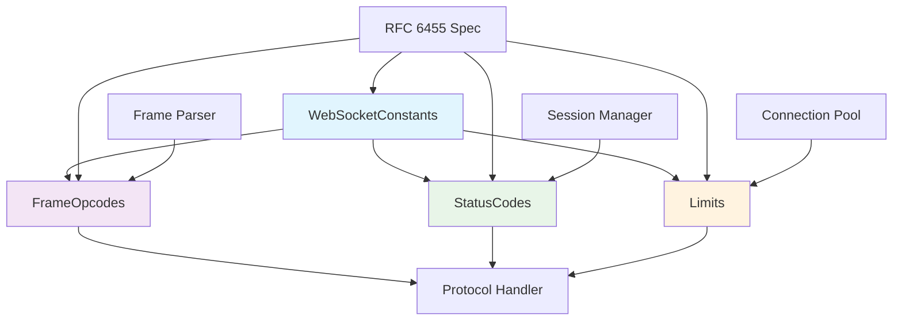

# Constants System

## 📋 Overview

The `constants/` directory contains all RFC 6455 WebSocket protocol constants, validation rules, and operational limits. This system ensures strict protocol compliance while providing compile-time safety and runtime validation for all WebSocket operations.

## 🎯 Main Purpose

The constants system serves as the **protocol compliance foundation** that provides:

- **RFC 6455 Compliance**: Complete implementation of WebSocket standard
- **Compile-time Safety**: `constexpr` validation and boundary checking
- **Operational Limits**: Size limits, timeouts, and protocol boundaries
- **Validation Rules**: Comprehensive protocol rule enforcement
- **Type Safety**: Strongly-typed constants and validation functions

## 🏗️ Architecture

```
constants/
├── WebSocketConstants.hpp  ───┐
├── FrameOpcodes.hpp        ──┤→ Protocol Definitions
├── StatusCodes.hpp         ──┤
└── Limits.hpp              ──┘→ Operational Boundaries
```

### **Protocol Compliance Flow**:
```
RFC 6455 Specification → Constants Headers → Validation Functions → Protocol Handler
         ↓                     ↓                     ↓                    ↓
      Standards            Definitions          Rule Checking        Implementation
```

## 📁 Component Overview

### **WebSocketConstants.hpp**
**Core protocol constants and definitions**

**Responsibilities**:
- WebSocket protocol magic strings and GUIDs
- HTTP header names for WebSocket handshake
- Frame formatting constants and bit masks
- Status code definitions

**Key Constants**:
- `WEBSOCKET_GUID`: "258EAFA5-E914-47DA-95CA-C5AB0DC85B11"
- `WEBSOCKET_VERSION`: "13"
- Frame bit masks: `FIN_BIT`, `RSV1_BIT`, `MASK_BIT`, etc.
- Header names: `Sec-WebSocket-Key`, `Upgrade`, `Connection`

### **FrameOpcodes.hpp**
**Frame type definitions and validation**

**Responsibilities**:
- Define all WebSocket frame opcodes
- Distinguish between control and data frames
- Provide opcode validation functions
- Support reserved opcode handling

**Frame Types**:
- **Data Frames**: `CONTINUATION`, `TEXT`, `BINARY`
- **Control Frames**: `CLOSE`, `PING`, `PONG`
- **Reserved Frames**: `RESERVED_3`-`RESERVED_7`, `RESERVED_B`-`RESERVED_F`

**Validation Functions**:
- `isControlFrame()` - Check if opcode is control frame
- `isDataFrame()` - Check if opcode is data frame
- `isReserved()` - Check if opcode is reserved
- `isValidOpcode()` - Comprehensive opcode validation

### **StatusCodes.hpp**
**Connection close status codes**

**Responsibilities**:
- Define WebSocket connection close reasons
- Provide status code validation
- Support custom application status codes
- Human-readable status descriptions

**Status Code Ranges**:
- **1000-1999**: Standard WebSocket status codes
- **3000-3999**: IANA registered codes
- **4000-4999**: Private application codes

**Key Status Codes**:
- `NORMAL_CLOSURE` (1000) - Clean connection termination
- `PROTOCOL_ERROR` (1002) - Protocol violation
- `MESSAGE_TOO_BIG` (1009) - Payload size exceeded
- `INTERNAL_SERVER_ERROR` (1011) - Server-side error

### **Limits.hpp**
**Protocol limits and operational boundaries**

**Responsibilities**:
- Define protocol-mandated size limits
- Specify implementation operational boundaries
- Provide validation functions for size checking
- Define timeout and buffer size defaults

**Key Limits**:
- **Frame Limits**: Header sizes, payload lengths
- **Control Frames**: Max 125 bytes for PING/PONG/CLOSE
- **Handshake**: 8KB max handshake size, 4KB headers
- **Timeouts**: Handshake, ping, pong, and close timeouts

## 🔄 Class Relationships



## 🛠️ Key Features

### **1. Compile-time Safety**
```cpp
// All validation happens at compile-time where possible
static_assert(Limits::isValidFrameSize(1024), "Invalid frame size");
static_assert(FrameOpcodes::isControlFrame(FrameOpcodes::PING), "Not control frame");
```

### **2. Comprehensive Validation**
```cpp
bool validateWebSocketFrame(const Frame& frame) {
    if (!FrameOpcodes::isValidOpcode(frame.opcode)) {
        return false;
    }
    
    if (FrameOpcodes::isControlFrame(frame.opcode) && 
        !Limits::isValidControlFrameSize(frame.payload.size())) {
        return false;
    }
    
    return Limits::isValidFrameSize(frame.payload.size());
}
```

### **3. Protocol Compliance Enforcement**
```cpp
void handleCloseFrame(uint16_t status_code, const std::string& reason) {
    if (!StatusCodes::isValidStatusCode(status_code)) {
        throw ProtocolError("Invalid status code");
    }
    
    if (!StatusCodes::canSendInCloseFrame(status_code)) {
        throw ProtocolError("Cannot send reserved status code");
    }
    
    if (!Limits::isValidCloseReasonSize(reason.size())) {
        throw ProtocolError("Close reason too long");
    }
}
```

## 🚀 Usage Examples

### **Frame Processing**:
```cpp
#include "constants/FrameOpcodes.hpp"
#include "constants/Limits.hpp"

class FrameProcessor {
public:
    Result processFrame(const WebSocketFrame& frame) {
        // Validate opcode
        if (!FrameOpcodes::isValidOpcode(frame.opcode)) {
            return Result::ERROR;
        }
        
        // Validate size based on frame type
        if (FrameOpcodes::isControlFrame(frame.opcode)) {
            if (!Limits::isValidControlFrameSize(frame.payload.size())) {
                return Result::ERROR;
            }
        }
        
        // Process frame based on type
        switch (frame.opcode) {
            case FrameOpcodes::TEXT:
                return processTextFrame(frame);
            case FrameOpcodes::PING:
                return processPingFrame(frame);
            // ... other cases
        }
    }
};
```

### **Handshake Validation**:
```cpp
#include "constants/WebSocketConstants.hpp"
#include "constants/Limits.hpp"

class HandshakeValidator {
public:
    bool validateHandshake(const HttpRequest& request) {
        // Check header sizes
        if (request.raw_size() > Limits::MAX_HANDSHAKE_SIZE) {
            return false;
        }
        
        // Verify required headers
        if (!request.has_header(WebSocketConstants::WEBSOCKET_KEY_HEADER)) {
            return false;
        }
        
        if (!request.has_header(WebSocketConstants::WEBSOCKET_VERSION_HEADER)) {
            return false;
        }
        
        // Verify WebSocket version
        auto version = request.get_header(WebSocketConstants::WEBSOCKET_VERSION_HEADER);
        return version == WebSocketConstants::WEBSOCKET_VERSION;
    }
};
```

### **Connection Closure**:
```cpp
#include "constants/StatusCodes.hpp"
#include "constants/Limits.hpp"

class ConnectionManager {
public:
    void closeConnection(ClientID client_id, uint16_t code, const std::string& reason) {
        // Validate status code
        if (!StatusCodes::isValidStatusCode(code)) {
            code = StatusCodes::INTERNAL_SERVER_ERROR;
        }
        
        // Truncate reason if too long
        std::string safe_reason = reason;
        if (safe_reason.size() > Limits::MAX_CLOSE_REASON_BYTES) {
            safe_reason.resize(Limits::MAX_CLOSE_REASON_BYTES);
        }
        
        // Send close frame
        sendCloseFrame(client_id, code, safe_reason);
        
        // Log closure reason
        logger->info("Connection {} closed: {} ({})", 
            client_id, 
            StatusCodes::getDescription(code),
            code);
    }
};
```

## 🔧 Integration with Other Layers

### **Protocol Layer Integration**:
```cpp
class ProtocolHandler {
    void handleIncomingFrame(const Buffer& data) {
        WebSocketFrame frame;
        
        // Use constants for frame parsing
        if (data.size() < WebSocketConstants::MIN_FRAME_HEADER_SIZE) {
            throw ProtocolError("Frame too small");
        }
        
        // Parse using bit masks from constants
        frame.fin = (data[0] & WebSocketConstants::FIN_BIT) != 0;
        frame.opcode = static_cast<FrameOpcodes::Opcode>(
            data[0] & WebSocketConstants::OPCODE_MASK);
        
        // Validate using constants validation
        if (!FrameOpcodes::isValidOpcode(frame.opcode)) {
            closeConnection(StatusCodes::PROTOCOL_ERROR);
            return;
        }
    }
};
```

### **Network Layer Integration**:
```cpp
class WebSocketSession {
    void configureTimeouts() {
        // Use default timeouts from constants
        setHandshakeTimeout(Limits::DEFAULT_HANDSHAKE_TIMEOUT);
        setPingInterval(Limits::DEFAULT_PING_INTERVAL);
        setPongTimeout(Limits::DEFAULT_PONG_TIMEOUT);
    }
    
    void applySizeLimits() {
        setMaxFrameSize(Limits::DEFAULT_MAX_FRAME_SIZE);
        setMaxMessageSize(Limits::DEFAULT_MAX_MESSAGE_SIZE);
    }
};
```

### **Configuration Integration**:
```cpp
class ConfigValidator {
    bool validateServerConfig(const ServerConfig& config) {
        // Validate against protocol limits
        if (config.max_frame_size > Limits::PRACTICAL_MAX_MESSAGE_SIZE) {
            return false;
        }
        
        if (config.ping_interval < Limits::MIN_PING_INTERVAL) {
            return false;
        }
        
        return true;
    }
};
```

## 📊 RFC 6455 Compliance

### **Section Coverage**:
- **Section 1.3**: Protocol Overview → `WebSocketConstants::WEBSOCKET_GUID`
- **Section 4.1**: Opening Handshake → `WebSocketConstants` header names
- **Section 5.2**: Base Framing → `FrameOpcodes` and frame format
- **Section 5.5**: Control Frames → `Limits::MAX_CONTROL_FRAME_PAYLOAD`
- **Section 7.4**: Closing Handshake → `StatusCodes` definitions

### **Protocol Rule Enforcement**:
```cpp
// Ensures all RFC 6455 rules are followed
class RFC6455Enforcer {
    bool validateFrameSequence(const std::vector<FrameOpcodes::Opcode>& sequence) {
        // RFC 6455: Control frames can be interjected in fragmented messages
        // but data frames must maintain proper fragmentation sequence
        
        bool expecting_continuation = false;
        
        for (auto opcode : sequence) {
            if (FrameOpcodes::isControlFrame(opcode)) {
                continue; // Control frames can appear anywhere
            }
            
            if (expecting_continuation) {
                if (opcode != FrameOpcodes::CONTINUATION) {
                    return false; // Violation: expected CONTINUATION frame
                }
            } else {
                if (!FrameOpcodes::isMessageInitiator(opcode)) {
                    return false; // Violation: expected TEXT or BINARY frame
                }
                expecting_continuation = true;
            }
        }
        
        return true;
    }
};
```

## 🔒 Security Considerations

### **Input Validation**:
- All frame sizes validated against protocol limits
- Opcode values checked for reserved ranges
- Status codes validated before transmission
- Buffer sizes limited to prevent memory exhaustion

### **Protocol Enforcement**:
- Control frame size limits enforced
- Fragmentation rules strictly followed
- Reserved bits and opcodes properly handled
- Close frame reasons length-limited

## 🎯 Benefits

### **1. Protocol Compliance**
- Complete RFC 6455 implementation
- All mandatory constants and limits defined
- Proper handling of reserved values
- Comprehensive validation rules

### **2. Code Safety**
- Compile-time validation where possible
- Runtime checks for dynamic values
- Type-safe constant usage
- Boundary checking on all operations

### **3. Maintainability**
- Single source of truth for protocol rules
- Clear separation of concerns
- Easy to update for protocol changes
- Comprehensive documentation

### **4. Performance**
- `constexpr` functions for compile-time evaluation
- Minimal runtime overhead for validation
- Efficient size checking and boundary validation
- Optimized for hot code paths

---

The constants system provides a robust, RFC 6455-compliant foundation for the WebSocket server implementation. Its comprehensive validation rules, compile-time safety, and clear organization make it an essential component for building reliable and standards-compliant WebSocket communication.