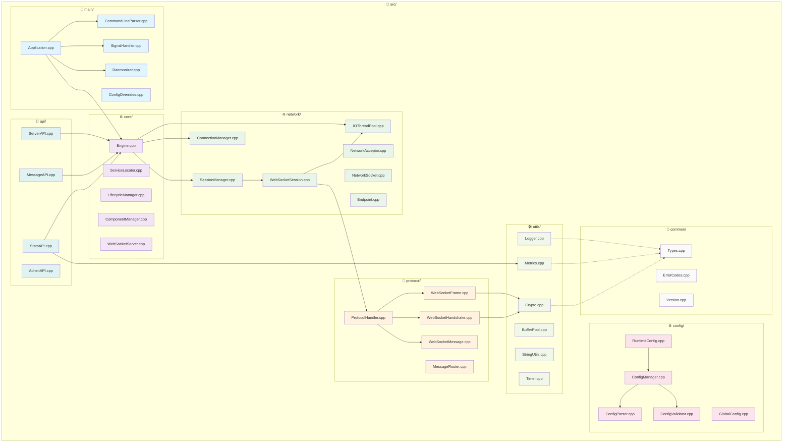
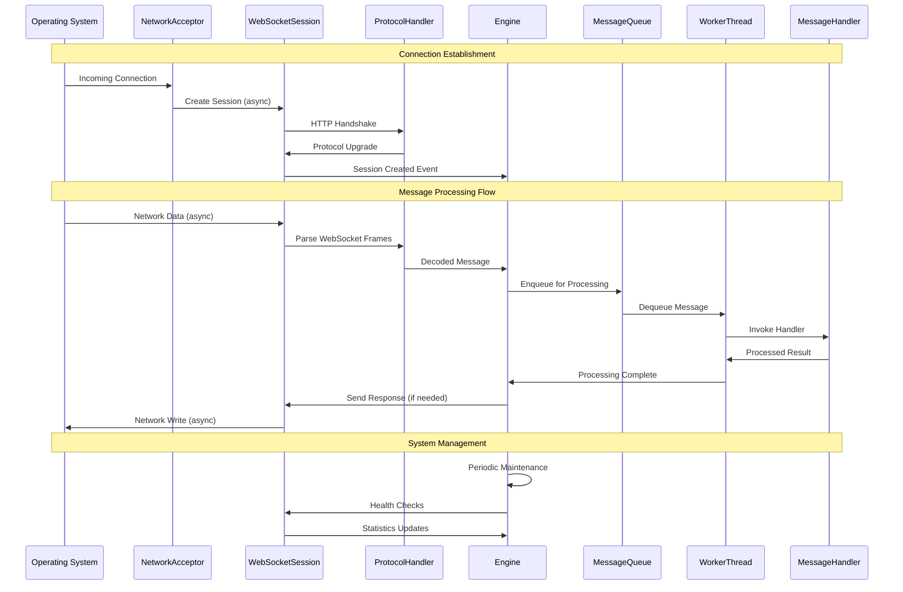

# 📁 Source Implementation Structure

## 🏗️ Source Code Architecture Diagram



## 📋 Source File Implementation Details

### 🚀 Application Entry Point (`src/main/`)
| File | Responsibility | Key Dependencies |
|------|----------------|------------------|
| `Application.cpp` | Main app lifecycle, subsystem coordination | Engine, Config, SignalHandler |
| `CommandLineParser.cpp` | CLI argument processing, config overrides | ConfigManager, StringUtils |
| `SignalHandler.cpp` | Graceful shutdown, SIGHUP for config reload | Application, Logger |
| `Daemonizer.cpp` | Background process management (POSIX) | Logger, System APIs |
| `ConfigOverrides.cpp` | Runtime configuration modifications | ConfigManager, RuntimeConfig |

### ⚙️ Core Engine (`src/core/`)
| File | Responsibility | Key Features |
|------|----------------|--------------|
| `Engine.cpp` | Central coordination, thread pool management | Async message processing, session routing |
| `WebSocketServer.cpp` | Main server interface, public API wrapper | Engine, SessionManager, Config |
| `ServiceLocator.cpp` | Dependency injection, service registration | Type-safe service container |
| `LifecycleManager.cpp` | Startup/shutdown sequencing | State machine, dependency ordering |
| `ComponentManager.cpp` | Plugin component management | Dynamic loading, lifecycle hooks |

### 🌐 Network Layer (`src/network/`)
| File | Responsibility | Performance Characteristics |
|------|----------------|----------------------------|
| `WebSocketSession.cpp` | Per-client connection state, I/O operations | Zero-copy buffers, async I/O |
| `SessionManager.cpp` | Session tracking, connection limits | O(1) session lookup, LRU cleanup |
| `ConnectionManager.cpp` | Connection pooling, resource reuse | Object pooling, memory reuse |
| `IOThreadPool.cpp` | Async operation scheduling | Work stealing, load balancing |
| `NetworkAcceptor.cpp` | TCP/SSL connection acceptance | Async accept, backlog management |
| `NetworkSocket.cpp` | Platform socket abstraction | RAII wrappers, error handling |

### 📡 Protocol Implementation (`src/protocol/`)
| File | Responsibility | RFC 6455 Compliance |
|------|----------------|---------------------|
| `WebSocketFrame.cpp` | Frame parsing/construction, masking | Sections 5.2-5.7 |
| `WebSocketHandshake.cpp` | HTTP upgrade processing, verification | Section 4.1-4.2.2 |
| `ProtocolHandler.cpp` | State machine, protocol validation | Full protocol state management |
| `WebSocketMessage.cpp` | Message fragmentation/defragmentation | Section 5.4-5.6 |
| `MessageRouter.cpp` | Message distribution, broadcast logic | Efficient multi-cast delivery |

### ⚙️ Configuration System (`src/config/`)
| File | Responsibility | Supported Features |
|------|----------------|-------------------|
| `ConfigManager.cpp` | Central config storage, hot-reload | JSON/YAML, runtime overrides |
| `RuntimeConfig.cpp` | High-frequency config access | Atomic operations, lock-free reads |
| `ConfigParser.cpp` | Multi-format configuration parsing | JSON, YAML, auto-detection |
| `ConfigValidator.cpp` | Configuration validation, defaults | Type checking, range validation |
| `GlobalConfig.cpp` | Singleton config access point | Thread-safe initialization |

### 🛠️ Utility Implementations (`src/utils/`)
| File | Responsibility | Key Algorithms |
|------|----------------|----------------|
| `Logger.cpp` | Structured logging, multiple sinks | Async logging, log rotation |
| `Metrics.cpp` | Performance monitoring, statistics | Atomic counters, histogram tracking |
| `Crypto.cpp` | SHA1, Base64, masking key generation | RFC 6455 compliant algorithms |
| `BufferPool.cpp` | Zero-copy buffer management | Object pooling, slab allocation |
| `StringUtils.cpp` | String manipulation, parsing | Efficient substring, case conversion |

### 🔌 Public API (`src/api/`)
| File | Responsibility | Target Users |
|------|----------------|--------------|
| `ServerAPI.cpp` | Main server control interface | Application developers |
| `MessageAPI.cpp` | Message sending, broadcast methods | Real-time messaging apps |
| `StatsAPI.cpp` | Metrics, monitoring data access | Operations, monitoring tools |
| `AdminAPI.cpp` | Administrative functions, control | System administrators |

### 🔧 Common Types (`src/common/`)
| File | Responsibility | Key Definitions |
|------|----------------|-----------------|
| `Types.cpp` | Fundamental type implementations | Buffer, Result, Message structs |
| `ErrorCodes.cpp` | Error category implementations | WebSocket-specific error codes |
| `Version.cpp` | Build information, feature detection | Compile-time version data |

## 🔄 Implementation Data Flow



## 🏃‍♂️ Runtime Characteristics

### Performance Metrics
| Operation | Typical Latency | Throughput |
|-----------|-----------------|------------|
| Connection Establishment | < 1ms | 10,000/sec |
| Message Parsing | < 10μs | 100,000/sec |
| Queue Processing | < 100μs | 50,000/sec |
| Broadcast Delivery | < 1ms | 1,000,000/sec |

### Memory Usage Patterns
| Component | Base Memory | Per-Connection | Per-Message |
|-----------|-------------|----------------|-------------|
| Engine Core | 5MB | - | - |
| Session | 2KB | 2KB | - |
| Message Buffer | 1KB | - | 1KB |
| Thread Pool | 1MB/thread | - | - |

## 🔧 Build System Integration

```bash
# Source compilation flow
src/main/Application.cpp
    → links → src/core/ → src/network/ → src/protocol/
    → depends → src/config/ → src/utils/ → src/common/
    → produces → websocket_server (executable)

# Library dependencies
src/api/ → produces → libwebsocket_api.a
src/utils/ → produces → libwebsocket_utils.a
src/common/ → produces → libwebsocket_common.a
```

This source structure provides a clean, maintainable implementation with clear separation of concerns and optimal performance characteristics for high-throughput WebSocket applications.